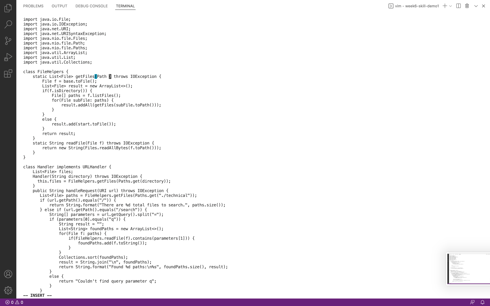
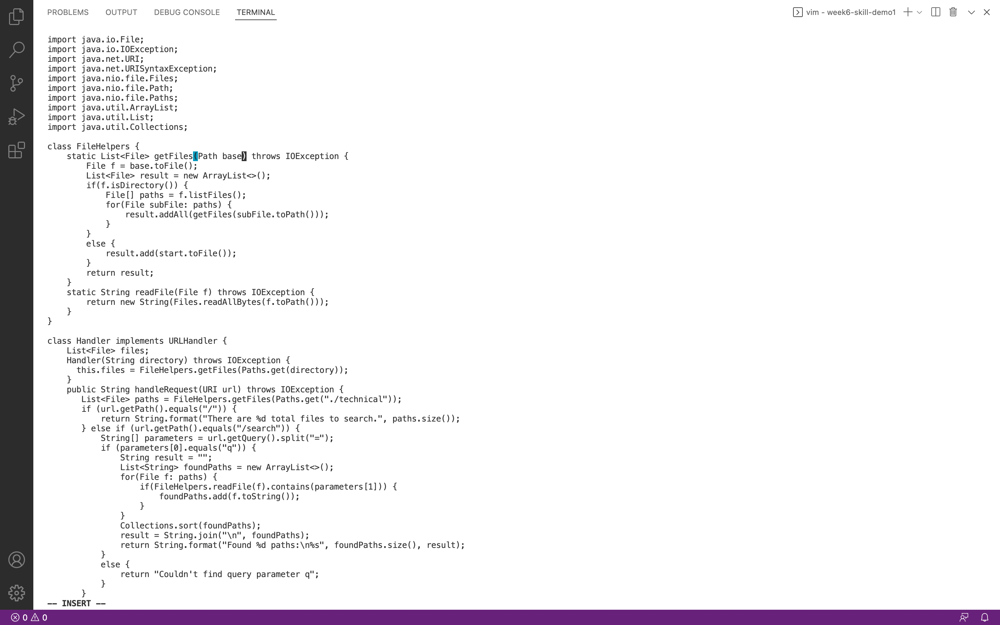
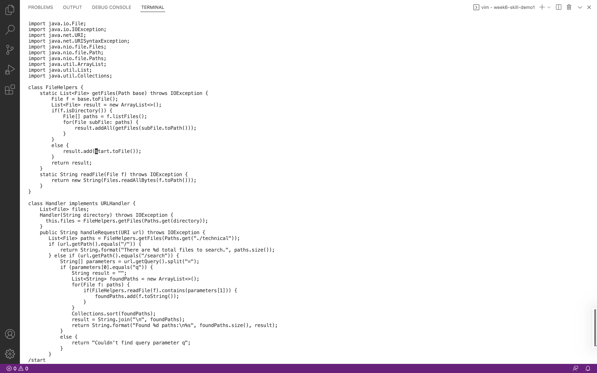
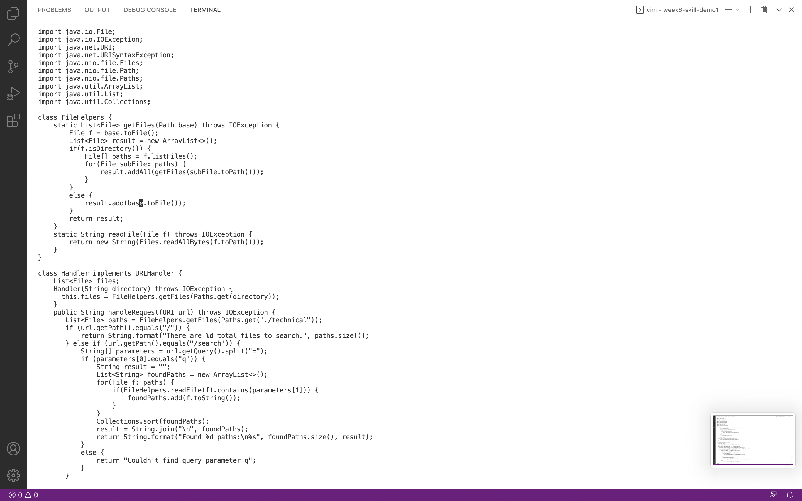
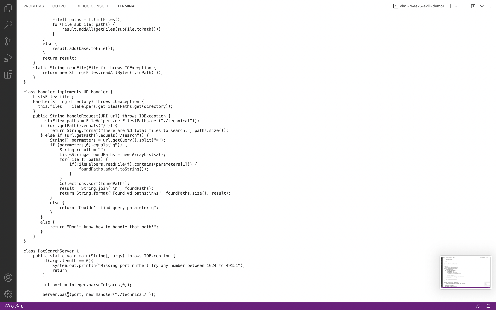
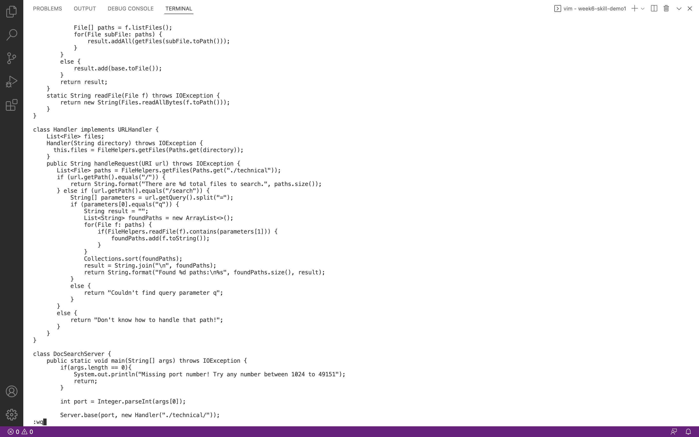

# Lab Report 4
## Part 1
Changing the name of the `start` parameter and its uses to `base`:
```
/start <enter> ce base <esc> N. N. :wq<enter> 
```
Total 24 keys pressed

`/start <enter>`: search for `start`


`ce`: delete the word `start`


`base <esc>`: type in `base`


`N`: jump to the next `start`


`.`: repeat the steps above - replace `start` with `base` 


`N`: jump to the next `start`


`.`: replace `start` with `base` 


`:wq`: save and exit 


## Part 2
* First Style: 46.08s

  I need to edit the files locally and run them remotely. It requires changing between local and remote servers.

* Second Style: 56.91s

  I'm not quite familiar with vim commands, so it may slow down my editing. 

* Which of these two styles would you prefer using if you had to work on a program that you were running remotely, and why?
  
  I prefer the first style. It is more intuitive for me to edit code in VScode. The built-in debugger in VScode can also point out the errors I make while editing. 

* What about the project or task might factor into your decision one way or another? (If nothing would affect your decision, say so and why!)
  
  If the files are large and take a long time to scp to remote server, I may choose to use the second style to save some time. 
  
