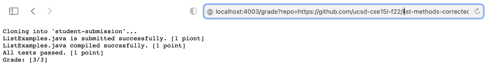
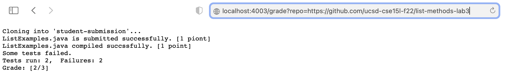
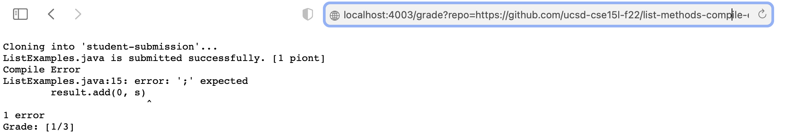

# Lab Report 5
## grade.sh
```
rm -rf student-submission
git clone $1 student-submission
score=0
 
# check the existence of the file
FILE=student-submission/ListExamples.java
SUBMISSION_FILE=ListExamples.java
if [[ -f "$FILE" ]]
then
   echo "$SUBMISSION_FILE is submitted successfully. [1 piont]"
   ((score+=1))
else
   echo "$SUBMISSION_FILE is not found."
   echo "Grade: [$score/3]"
   exit
fi

cp TestListExamples.java student-submission
cp -rf lib student-submission
cd student-submission
CPATH=".:lib/hamcrest-core-1.3.jar:lib/junit-4.13.2.jar"
 
# check if file compiles
javac -cp $CPATH *.java 2> compile_error.txt

if [[ $? -eq 0 ]]; then
    echo "$SUBMISSION_FILE compiled succssfully. [1 point]"
    ((score+=1))
 
else
    echo "Compile Error"
    cat compile_error.txt
    echo "Grade: [$score/3]"
    exit
fi

# run tests
java -cp $CPATH org.junit.runner.JUnitCore TestListExamples > test_result.txt
if [[ $? -eq 0 ]];then
   echo "All tests passed. [1 point]"
   ((score+=1))
else
   echo "Some tests failed."
   grep "Tests run" test_result.txt
fi
echo "Grade: [$score/3]"
```
## Student Submissions
[student submission 1](https://github.com/ucsd-cse15l-f22/list-methods-corrected)
<br> reported grade:


[student submission 2](https://github.com/ucsd-cse15l-f22/list-methods-lab3)
<br> reported grade:


[student submission 3](https://github.com/ucsd-cse15l-f22/list-methods-compile-error)
<br> reported grade:


## Trace of the Script
[student submission 3](https://github.com/ucsd-cse15l-f22/list-methods-compile-error)

First, we check if the file is submitted successfully. `if [[ -f "$FILE" ]]` is true in this case because the file `student-submission/ListExamples.java` is in the student submission. 
So we `echo "$SUBMISSION_FILE is submitted successfully. [1 piont]"` and increase the score by 1. Its return code is 0. 
<br> Then we test if the file compiles. The return code of `javac -cp $CPATH *.java 2> compile_error.txt` is non-zero in this case since the file didn't compile. The standard error is
```
ListExamples.java:15: error: ';' expected
        result.add(0, s)
                        ^
1 error
```
`if [[ $? -eq 0 ]]` is false in this case because the return code is not 0. So we skip the script that only runs when the if statement is true. We run the script in else statement. We print compile error and the final grade. After that, we exit the script. The script after the exit will not run because the file does not compile, there's no meaning to run tests on the submission. 

